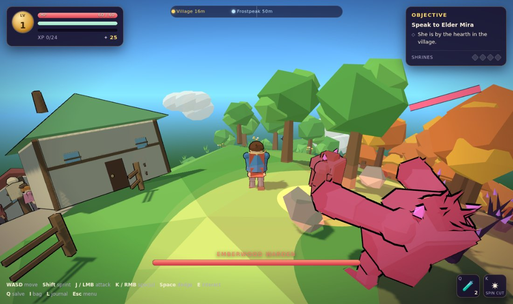
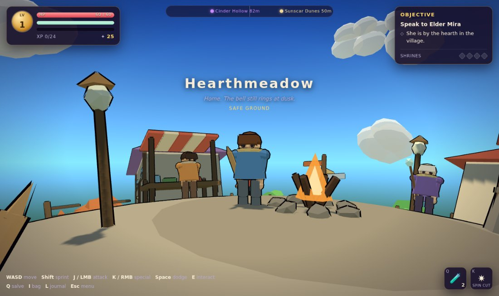
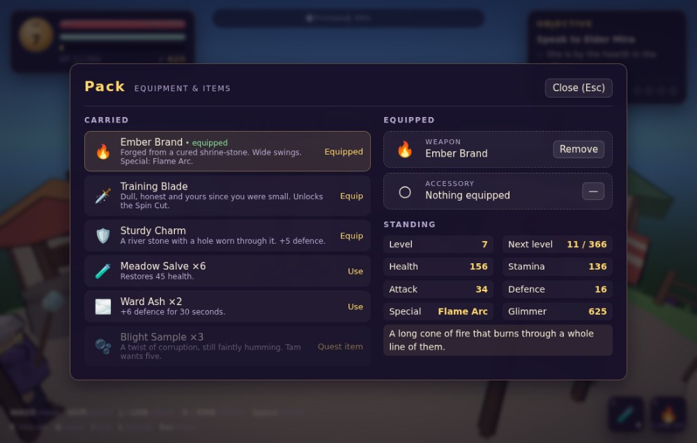

# Tiny Planet — Shrines of the Blight

A compact 3D action-RPG that takes place on the surface of a small round world.
You walk all the way around it, fight the blight, level up, find gear, take on a
handful of quests, and cure four corrupted shrines. Progress survives a page
refresh.

Built with **Three.js + TypeScript + Vite**, with a DOM overlay for the UI,
**Dexie/IndexedDB** for saves, and a **Web Audio** engine that synthesises every
sound and every note of the score at runtime.



> *An Emberwood Warden mid-wind-up. The ring on the ground covers exactly the
> area that is about to hurt.*

```bash
npm install
npm run dev      # http://localhost:5173
npm run build    # typecheck + production bundle into dist/
npm run preview  # serve the production bundle
```

---

## The game

A young hero leaves the village of Hearthmeadow to find out why the planet's four
shrines have gone silent. Each biome holds a corrupted shrine guarded by a warden.
Break the warden, lay a hand on the shrine stone, and the land around it heals —
visibly: the ground repaints, the sky lifts, and the biome's music gains an
octave. Cure all four and the world sings.

**Loop:** explore → fight for XP → level up → spend glimmer on gear → take the
next shrine → come home and hand the quest in.

### Controls

| Action | Keyboard / Mouse | Touch |
| --- | --- | --- |
| Move | `W A S D` / arrows | left thumb-stick |
| Sprint | `Shift` (costs stamina) | — |
| Attack | `J` or left mouse | **Attack** |
| Special | `K` or right mouse | **Special** |
| Dodge roll | `Space` | **Dodge** |
| Interact / talk | `E` | **Talk** |
| Drink a salve | `Q` | — |
| Pack | `I` or `Tab` | **Bag** |
| Journal | `L` | — |
| Pause / settings | `Esc` | — |
| Look around | drag, or move the mouse after clicking (pointer lock) | drag anywhere |
| Zoom | mouse wheel | — |

Attacks are a three-hit combo — light, light, heavy. The heavy finisher costs more
stamina and leaves you open, so it is a choice rather than a rhythm. The dodge roll
has a window of invulnerability in the middle: rolling **through** an attack is
free, rolling away from it just costs you ground.

Every enemy attack is telegraphed. The body rears back, a coloured ring grows on
the ground covering exactly the area that is about to be dangerous, and a low tone
plays. Wind-ups track you only slowly, so side-stepping a brute genuinely works.

### Enemies

| | Behaviour |
| --- | --- |
| **Blight Mote** | Fast, fragile, swarms. Short wind-up, dies to one clean combo. |
| **Husk Brute** | Slow heavy-hitter. Long, readable overhead swing; shrugs off stagger. |
| **Thorn Spitter** | Keeps its distance and spits bolts. Crowd it or eat chip damage. |
| **Shrine Warden** | Biome boss. A grown brute with an area slam that calls motes in at half health. |



### Biomes

| Biome | Distance from home | Suggested level |
| --- | --- | --- |
| Hearthmeadow (village hub) | — | 1 |
| Emberwood | ~31 units | 2 |
| Sunscar Dunes | ~50 units | 4 |
| Frostpeak | ~50 units | 6 |
| Cinder Hollow | ~81 units | 8 |

The whole planet is 188 units around, so a full lap is about half a minute at a
sprint. You cannot see far — the horizon is roughly ten metres of ground ahead of
you — which is why the HUD carries a compass ribbon marking the village and all
four shrines by bearing and distance.

---



## Architecture

```
src/
  core/        sphere maths, input, frame loop, event bus, game shell, debug
  render/      renderer + lighting, camera rig, toon materials, VFX, geometry builder
  world/       planet mesh, biomes, procedural props, scatter, village, shrines, sky
  entities/    actor base, pose rig, procedural models, player, enemies, NPCs, drops
  rpg/         stats, items, specials, quests, dialogue content, shared ids
  state/       zustand store, derived stats, actions
  save/        Dexie database, save/load and migration
  ui/          HUD, dialogue, panels, floating text, touch controls, stylesheet
```

### Walking on a sphere

An actor's transform is not a position and a rotation. It is:

- `dir` — a unit vector from the planet's centre (*where on the globe*)
- `forward` — a unit vector tangent to the sphere at `dir` (*which way*)

Walking rotates **both** vectors about the axis `dir × forward`. That is an exact
great-circle step, and because `forward` rides the same rotation it is
parallel-transported: you can walk over a pole and your heading does not snap.
`src/core/SphereMath.ts` has the whole vocabulary — `walk`, `headingTo`,
`signedTangentAngle`, `turnTowards`, `orientationFrom`.

The camera keeps its own heading as a tangent vector, re-projected into the
player's tangent plane every frame, so the view stays put in world terms as you
move instead of spinning. Its `up` is the player's local up, so "down" on screen
is always towards the core.

One thing that surprised us: on a planet this small the ground falls away behind
the player fast enough that a given camera pitch reads about 18° steeper than the
same pitch would on flat terrain. The default pitch is set low to compensate.

### Terrain

The height field is a sum of plane waves evaluated on the unit sphere. Because
every term is a smooth function of the 3D position it is seamless across the whole
globe — no UV wrapping, no pole pinching — and it is cheap enough to call
per-frame for every actor's footing. Flattening zones level the village square and
the shrine plazas before anything samples the surface.

The planet is a displaced icosphere with per-face vertex colours. The geometry is
non-indexed, so each triangle owns its three vertices: writing one colour to all
three gives clean facets, and it lets the mesh be repainted at runtime — which is
how curing a shrine heals the land around it.

### Art: procedural, not imported

Every model in the game — hero, enemies, villagers, trees, houses, shrines — is
assembled at runtime from cached primitives (boxes, cones, cylinders,
icospheres) with baked vertex colours, via `GeoBuilder`. That means one shared
material and a single draw call per prop or character, no asset pipeline, no
loading screen and no third-party licences to track. See
[ASSETS.md](./ASSETS.md) for how to swap in Kenney/Quaternius GLBs instead if you
would rather have authored art.

Cel shading is `MeshToonMaterial` with a banded gradient map, the approach used by
the three.js toon examples, plus an inverted-hull outline pass on characters and
shrines.

Animation is a small **pose-blending rig**: each clip is a function that writes
euler targets, and the rig eases live bones towards them. Transitions come free,
and combat can dial the easing half-life per state — which is what gives attacks
their snap and wind-ups their weight.

### Village on a curve

A village square 12 units across cannot be one flat mesh: on a 30-unit planet its
rim would hang two and a half metres above the ground. Each building is authored
flat, then pushed onto the geometry builder with the transform that stands it
upright at its own spot on the curve, all relative to the village object — so the
whole village still merges into one draw call. The square itself is generated as a
spherical cap.

### Audio

No audio files. `src/audio/Audio.ts` synthesises 24 sound effects from oscillators,
filtered noise and envelopes, through a generated convolution reverb. Because every
sound comes from parameters rather than a buffer, a light hit and a heavy hit are
the same routine with different numbers.

The score is a lookahead scheduler queueing sixteenth notes 150 ms ahead, so timing
stays sample-accurate when the main thread stutters. Each biome has its own root,
mode and tempo; a combat-intensity parameter swells the drums and brings in a lead
line as enemies close; curing a biome's shrine lifts its arpeggio an octave.

### Saving

Only progress is stored — level, stats, inventory, equipment, quest counters,
shrine flags and world position. The world is regenerated from a single integer
seed, so a save is a couple of kilobytes no matter how many trees are on the
planet. Autosave runs every 20 seconds, on every quest and level event, on biome
transitions, and on `pagehide`.

IndexedDB (through Dexie) is the real store, with a localStorage fallback for
browsers that refuse IndexedDB in private windows. On load every field is merged
onto a fresh initial state, so a save written by an older build still opens.

### Performance

The horizon on this planet is about ten metres, so anything beyond it is invisible
and should not cost anything:

- **Enemy LOD** — past 30 units an enemy stops rendering and its AI ticks at 4 Hz
  on pooled time; past 78 units it stops entirely.
- **Frustum culling per biome** — scatter is one `InstancedMesh` per biome × prop
  kind, each covering about a fifth of the globe, so three or four biomes' worth of
  greenery is culled at any moment.
- **Camera collision** — blockers carry a height, and the camera pulls in rather
  than letting a canopy fill the screen.
- A typical frame is ~240 draw calls and ~65k triangles at the low quality setting.

The **High detail** toggle in the pause menu controls shadows, pixel ratio, planet
tessellation and scatter density together.

### Debugging

`window.__debug()` returns a read-only snapshot — position, player state, biome,
nearest enemy, quest stages, draw calls, frame count. It ships in production
because it is harmless and makes bug reports precise.

In a dev build only (`npm run dev`), `window.__cheat` adds `teleport(biome)`,
`gotoNpc(id)`, `gotoEnemy(kind)`, `xp(n)`, `glimmer(n)`, `grant(item)`,
`hurt(n)` and `killAll(kind?)`.

---

## Scope

Deliberately small: four stats and one level, no skill tree, three enemy types plus
a boss variant, two equipment slots, seven quests, dialogue that colours the
exchange rather than forking the story. The aim was a complete, finishable small
RPG rather than a framework.

## Licence

MIT — see [LICENSE](./LICENSE). All art and audio are generated by the code in this
repository, so there is nothing else to attribute.
